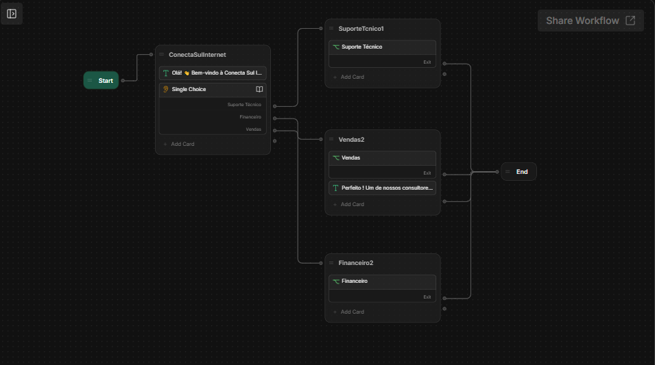
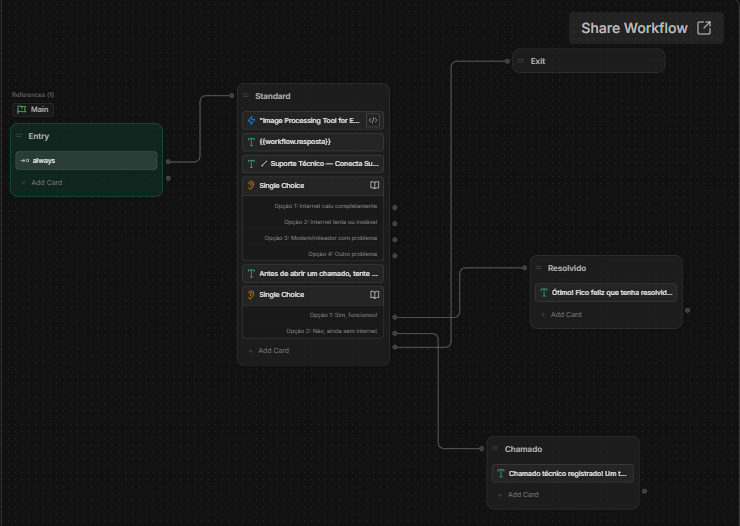
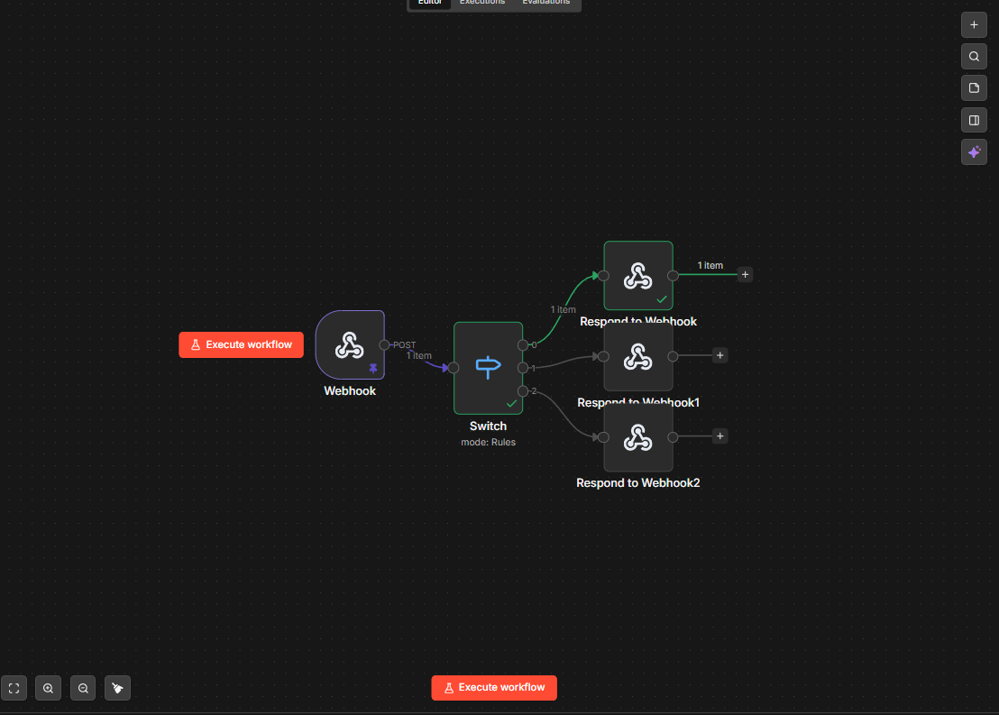
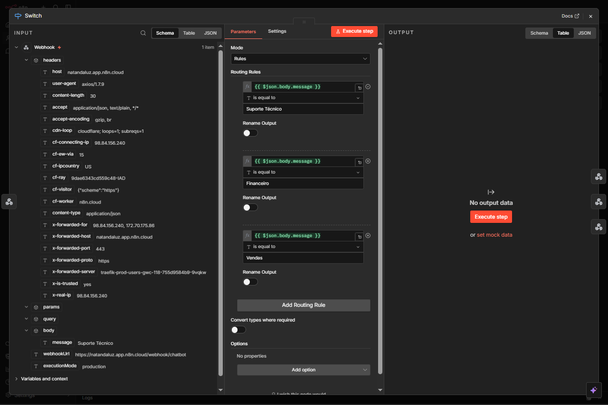
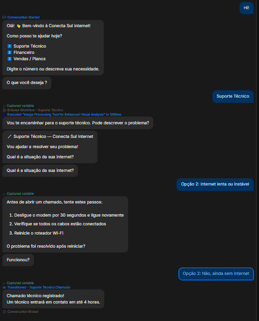

# Chatbot Webhook Integration (Botpress + n8n)

Projeto que demonstra a integração entre um chatbot desenvolvido no Botpress e um fluxo de automação no n8n, utilizando Webhooks HTTP para comunicação entre serviços e Docker para execução do ambiente de automação, dentro de uma arquitetura modular orientada a workflows.


## Visão Geral

Este projeto demonstra a integração entre um chatbot desenvolvido no **Botpress** e um fluxo de automação criado no **n8n**, utilizando **Webhooks HTTP** para comunicação entre os sistemas.

A solução simula o atendimento automatizado de uma empresa fictícia chamada **Conecta Sul Internet**. Através do chatbot, o usuário pode selecionar diferentes departamentos da empresa, e cada solicitação é processada por um fluxo automatizado no backend.

A arquitetura separa a **interface conversacional** (chatbot) da **lógica de processamento** (automação no n8n), criando um fluxo modular e organizado para tratamento das solicitações.

## Objetivo do Projeto

Este projeto tem como objetivo demonstrar a integração entre um chatbot conversacional desenvolvido no Botpress e um fluxo de automação criado no n8n, utilizando Webhooks HTTP para comunicação entre sistemas.

A solução evidencia como plataformas de chatbot podem atuar como interface de entrada para sistemas automatizados, permitindo a construção de arquiteturas modulares para atendimento automatizado e integração de serviços.

## Demonstração

Abaixo estão capturas de tela demonstrando os principais componentes da solução:

- Arquitetura geral da integração entre chatbot e automação.
- Estrutura de workflows no Botpress.
- Fluxo de automação implementado no n8n.
- Teste do chatbot em execução.

## Arquitetura Tecnológica

A solução foi construída utilizando uma arquitetura baseada em integração de serviços. Os principais componentes são:

- **Botpress**: responsável pela interface conversacional e gestão dos fluxos do chatbot.
- **n8n**: responsável pela automação de processos e processamento das requisições recebidas.
- **Webhooks HTTP**: utilizados como mecanismo de comunicação entre os sistemas.
- **Docker**: utilizado para execução do n8n em ambiente containerizado.

## Diagrama de Arquitetura

Usuário > Chatbot(Botpress) > Webhook HTTP > n8n(Workflow Automation) > Switch Node > Respond to Webhook > Resposta ao chatbot

A comunicação entre os componentes ocorre da seguinte forma:

1. Usuário
2. Chatbot (Botpress)
3. Requisição HTTP / Webhook → n8n
4. Switch Node (roteamento por departamento)
5. Respond to Webhook
6. Botpress recebe a resposta
7. Usuário visualiza a resposta no chatbot

Nesse modelo:

- **Botpress** é responsável pela interface do chatbot e pelos fluxos de conversa.
- **n8n** processa as requisições recebidas e retorna as respostas.
- **Webhooks HTTP** fazem a comunicação entre os dois sistemas.

## Fluxo da Integração

1. O usuário inicia uma conversa no chatbot.
2. O Botpress apresenta um menu com os departamentos disponíveis.
3. Ao selecionar um departamento, o Botpress envia uma requisição HTTP para um webhook do n8n.
4. O n8n recebe a requisição e analisa o parâmetro enviado.
5. O **Switch Node** direciona a requisição para o fluxo correto.
6. O n8n retorna uma resposta em JSON.
7. O Botpress recebe essa resposta e exibe a mensagem ao usuário.

### Diagramas do Sistema

- Arquitetura geral do chatbot (visão 1):  
  

- Arquitetura geral do chatbot (visão 2):  
  

- Automação no n8n:  
  

- Workflow dentro do n8n:  
  

- Exemplo de teste do chatbot:  
  

## Implementação do Chatbot (Botpress)

O chatbot foi desenvolvido utilizando **Botpress Studio**, com workflows organizados para representar diferentes departamentos da empresa.

O fluxo principal (**Main Workflow**) apresenta uma mensagem de boas-vindas e um menu com três opções de atendimento:

- Suporte Técnico
- Financeiro
- Vendas

Cada opção direciona o usuário para um workflow específico, responsável por realizar a integração com o sistema de automação.

Dentro desses workflows, o chatbot envia uma **requisição HTTP** para um **webhook do n8n**, informando qual departamento foi selecionado pelo usuário.

## Automação no n8n

No **n8n** foi criado um workflow responsável por receber e processar as requisições enviadas pelo chatbot.

O fluxo é composto por:

- **Webhook Node**  
  Recebe as requisições HTTP enviadas pelo Botpress.

- **Switch Node**  
  Analisa o conteúdo da requisição para identificar qual departamento foi selecionado.

- **Respond to Webhook**  
  Retorna uma resposta em formato JSON, contendo a mensagem que será exibida para o usuário no chatbot.

Esse fluxo permite **rotear as solicitações dinamicamente** e retornar respostas diferentes conforme o departamento escolhido.

## Execução do n8n com Docker

O n8n é executado localmente utilizando **Docker**, permitindo rodar o serviço em um ambiente isolado e facilmente reproduzível.

Exemplo de comando utilizado para iniciar o container em segundo plano:

```bash
docker run -d --name n8n -p 5678:5678 n8nio/n8n
```

Após iniciar o container, a interface do n8n pode ser acessada em:

- http://localhost:5678

## Estrutura do Projeto

```text
.
│
├── botpress
│   └── conecta-sul-chatbot.bpz
│
├── n8n
│   └── workflow.json
│
├── docs
│   ├── botpress-architecture.png
│   ├── botpress-workflow.png
│   ├── n8n-automation.png
│   ├── n8n-workflow.png
│   └── chatbot-test.png
│
└── README.md
```

O repositório inclui:

- Exportação do projeto do chatbot no **Botpress**.
- Exportação do workflow criado no **n8n**.
- Imagens documentando os fluxos do sistema (na pasta `docs/`).
- Documentação explicando a arquitetura da solução.

## Tecnologias Utilizadas

- **Botpress Studio** — plataforma para desenvolvimento de chatbots conversacionais.
- **n8n** — ferramenta de automação de workflows baseada em nodes.
- **Webhooks / HTTP** — mecanismo de comunicação entre serviços.
- **Docker** — execução do ambiente de automação em container.
- **JSON** — formato utilizado para troca de dados entre sistemas.

## Pré-requisitos

Antes de executar o projeto, é recomendado ter instalado:

- Docker
- Botpress Studio
- n8n (local ou em container)
- Git

## Como Executar o Projeto

### 1. Clonar o repositório

```bash
git clone https://github.com/NatanLuz/chatbot-webhook-integration-botpress-n8n.git
cd chatbot-webhook-integration-botpress-n8n
```

Se preferir, você também pode baixar os arquivos diretamente pelo GitHub.

### 2. Executar o n8n com Docker

```bash
docker run -d --name n8n -p 5678:5678 n8nio/n8n
```

Após iniciar o container, o painel do n8n ficará disponível em:

- http://localhost:5678

### 2. Executar o n8n com Docker Compose

Como alternativa, você pode iniciar o n8n utilizando **Docker Compose**, tornando o ambiente mais fácil de reproduzir e com volume persistente já configurado.

Na raiz do projeto, execute:

```bash
docker compose up -d
```

O serviço do n8n será iniciado em segundo plano utilizando o arquivo `docker-compose.yml`, com:

- Porta `5678` exposta em `http://localhost:5678`.
- Volume persistente para os dados em `n8n_data`.
- Política de reinício `restart: unless-stopped`.

### 3. Importar o Workflow no n8n

1. Acesse o painel do n8n.
2. Clique em **Import Workflow**.
3. Selecione o arquivo localizado em:

- n8n/workflow.json

### 4. Importar o chatbot no Botpress

1. Abra o **Botpress Studio**.
2. Utilize a opção **Import Bot**.
3. Selecione o arquivo:

- botpress/conecta-sul-chatbot.bpz

## Conceitos Demonstrados

Este projeto demonstra na prática conceitos importantes como:

- Desenvolvimento de chatbots.
- Automação de fluxos com n8n.
- Integração entre sistemas utilizando Webhooks.
- Roteamento de requisições com base em parâmetros.
- Separação entre interface conversacional e lógica de backend.
- Execução de serviços em containers com Docker.

## Possíveis Aplicações

A arquitetura utilizada neste projeto pode ser aplicada em diversos cenários, como:

- Sistemas de atendimento automatizado.
- Chatbots integrados com serviços de backend.
- Automação de processos empresariais.
- Integração entre plataformas conversacionais e sistemas internos.

## Autor

**Natan da Luz**  
Desenvolvedor Backend

LinkedIn:  
https://www.linkedin.com/in/natandaluzdesenvolvedor/
