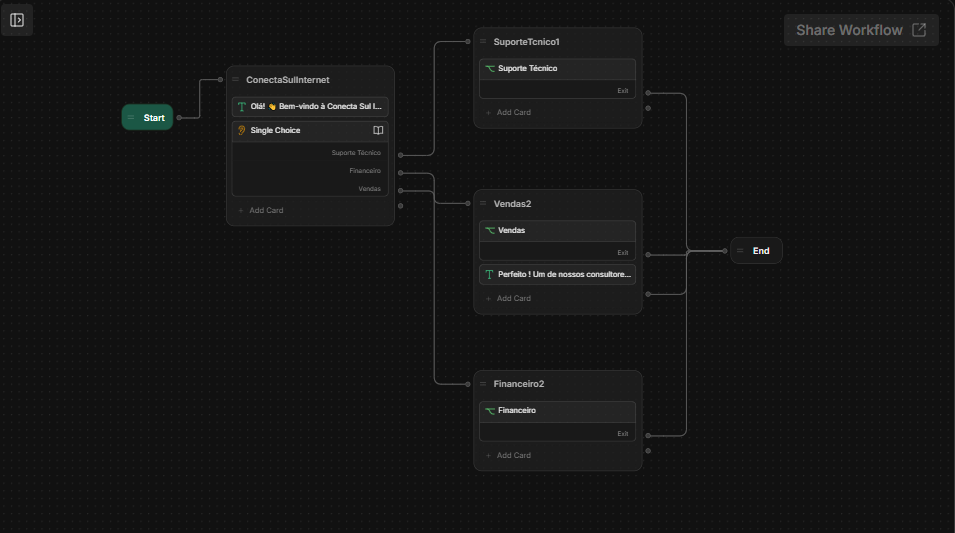
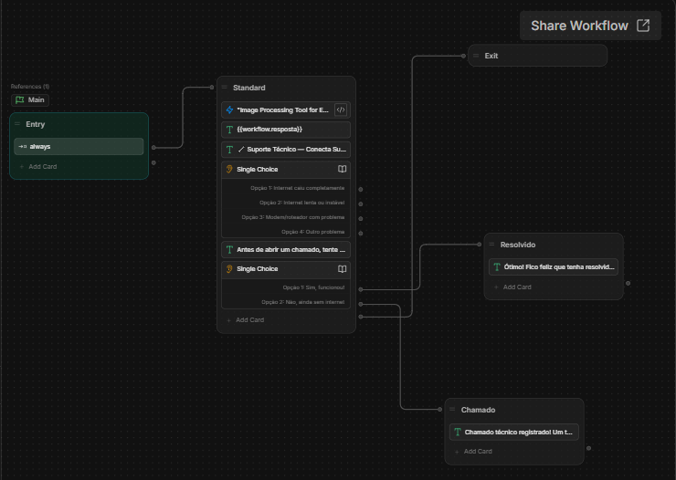
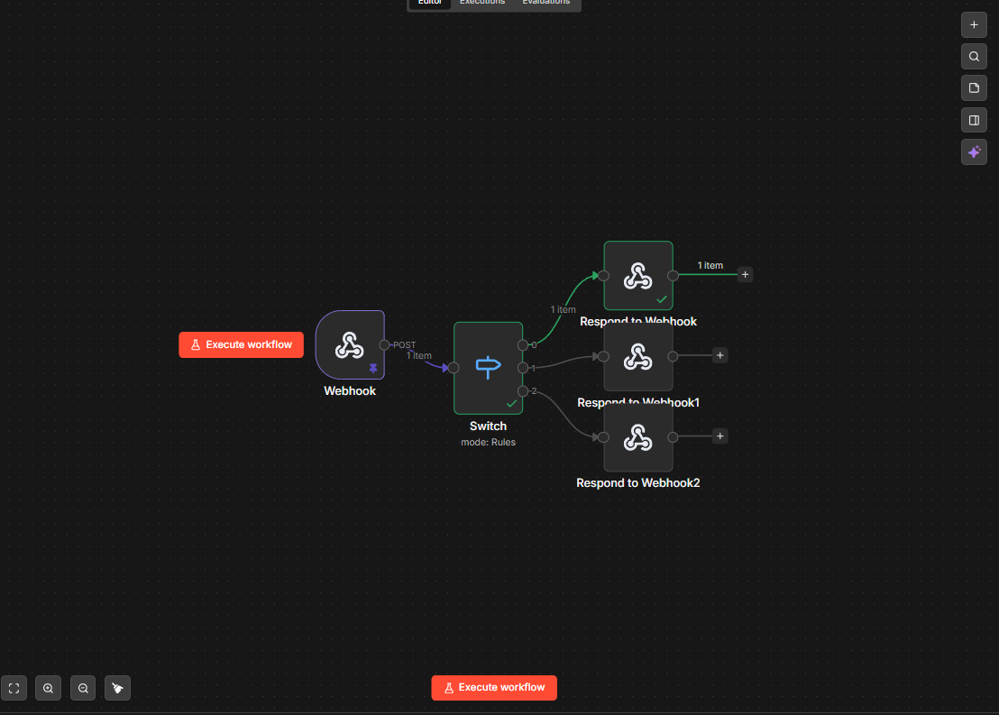
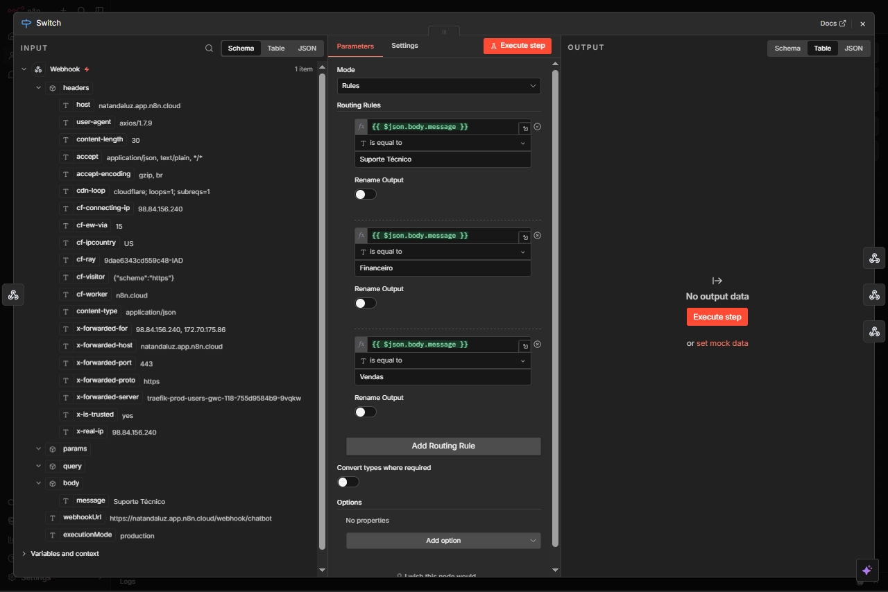
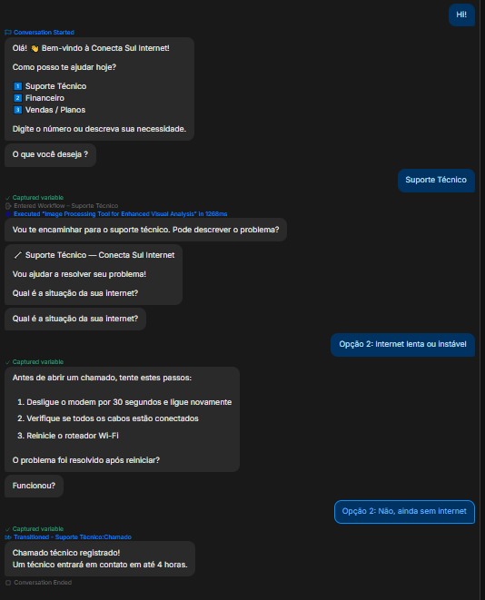

# Integração de Webhook para Chatbot (Botpress + N8N)


## 📖 Sobre o projeto

O **Chatbot Webhook Integration** demonstra a integração entre um chatbot desenvolvido no Botpress e um fluxo de automação criado no n8n. A comunicação entre os sistemas ocorre por Webhooks HTTP, enquanto o ambiente de automação pode ser executado em um container Docker.

A aplicação simula o atendimento automatizado da empresa fictícia ""**Conecta Sul Internet**"". A solução separa a interface conversacional, gerenciada pelo Botpress, da lógica de processamento, executada pelos workflows do n8n. Essa divisão resulta em uma arquitetura desacoplada, modular e organizada.

O objetivo do projeto é apresentar, de maneira prática, como plataformas de chatbot podem atuar como interface de entrada para processos automatizados e integrações entre serviços.

## Arquitetura da integração feita

```text
Usuário
  ↓
Chatbot (Botpress)
  ↓
Webhook HTTP
  ↓
n8n (Workflow Automation)
  ↓
Switch Node
  ↓
Respond to Webhook
  ↓
Resposta ao chatbot
```

### Fluxo da aplicação

1. O usuário inicia a conversa;
2. o chatbot apresenta os departamentos disponíveis;
3. o Botpress envia uma requisição HTTP para o n8n;
4. o Webhook Node recebe a requisição;
5. o Switch Node identifica o departamento selecionado;
6. o fluxo correspondente é executado;
7. o Respond to Webhook retorna uma resposta em JSON;
8. o Botpress apresenta a resposta ao usuário.

## ✨ Funcionalidades

- Chatbot desenvolvido no Botpress Studio;
- menu de atendimento para Suporte Técnico, Financeiro e Vendas;
- workflows específicos para os departamentos;
- comunicação entre Botpress e n8n por Webhooks HTTP;
- processamento automatizado das requisições no n8n;
- roteamento por departamento com o Switch Node;
- retorno das respostas em formato JSON pelo Respond to Webhook;
- execução do n8n em ambiente Docker;
- exportação do chatbot no formato `.bpz`;
- exportação do workflow no formato `.json`;
- arquitetura modular baseada em workflows.

## 🖼️ Screenshots

### Arquitetura do Botpress



### Estrutura dos workflows



### Automação no n8n



### Workflow do n8n



### Teste do chatbot



## 🚀 Tecnologias

- **Botpress Studio:** criação da interface conversacional e dos fluxos do chatbot;
- **n8n:** processamento das requisições e automação dos workflows;
- **Docker:** execução do n8n em um ambiente isolado e reproduzível;
- **Webhooks HTTP:** comunicação entre o Botpress e o n8n;
- **JSON:** formato utilizado para troca de dados entre os sistemas.

## ⚙️ Como executar

### Pré-requisitos

- Git;
- Docker;
- Docker Compose;
- acesso ao Botpress Studio.

### Clonar o repositório

```bash
git clone https://github.com/NatanLuz/chatbot-webhook-integration-botpress-n8n.git
cd chatbot-webhook-integration-botpress-n8n
```

Também é possível baixar os arquivos diretamente pelo GitHub.

### Executar o n8n com Docker

Inicie o container em segundo plano:

```bash
docker run -d --name n8n -p 5678:5678 n8nio/n8n
```

Após a inicialização, acesse o painel em:

```text
http://localhost:5678
```

### Executar o n8n com Docker Compose

Como alternativa, execute na raiz do projeto:

```bash
docker compose up -d
```

O serviço será iniciado em segundo plano por meio do arquivo `docker-compose.yml`, com a porta `5678` exposta, volume persistente `n8n_data` e política de reinício `restart: unless-stopped`.

### Importar o workflow no n8n

1. Acesse `http://localhost:5678`;
2. selecione a opção **Import Workflow**;
3. importe o arquivo `n8n/workflow.json`.

### Importar o chatbot no Botpress

1. Abra o Botpress Studio;
2. selecione a opção **Import Bot**;
3. importe o arquivo `botpress/conecta-sul-chatbot.bpz`.

## 📂 Estrutura do projeto

O repositório mantém separadas as exportações do chatbot, do workflow e as imagens da documentação:

```text
.
├── botpress/
│   └── conecta-sul-chatbot.bpz
├── n8n/
│   └── workflow.json
├── docs/
│   ├── arquiteturabotpress.png
│   ├── arquiteturabotpress2.png
│   ├── automacaon8n.png
│   ├── n8n-workflow.png
│   └── testechatbot.png
└── README.md
```

- `botpress/conecta-sul-chatbot.bpz`: exportação do chatbot;
- `n8n/workflow.json`: exportação do workflow de automação;
- `docs/`: diagramas e capturas de tela da solução;
- `README.md`: documentação técnica do projeto.

## 🌐 Deploy

Este é um projeto de integração entre plataformas. O n8n pode ser executado localmente com Docker ou hospedado em um servidor compatível. O Botpress pode ser utilizado localmente ou em seu ambiente cloud, conforme a edição adotada.

Para um ambiente de produção, a arquitetura pode ser adaptada com a publicação dos serviços, configuração das URLs dos Webhooks, persistência dos dados do n8n e aplicação dos controles de segurança necessários.

## 👤 Autor

**Natan Da Luz**

- LinkedIn: [linkedin.com/in/natandaluz](https://www.linkedin.com/in/natandaluz/)
- Portfólio: [portfolionatan.vercel.app](https://portfolionatan.vercel.app/)
- E-mail: [natandaluz01@gmail.com](mailto:natandaluz01@gmail.com)

## 📄 Licença

Este projeto está sem uma licença definida no momento.
